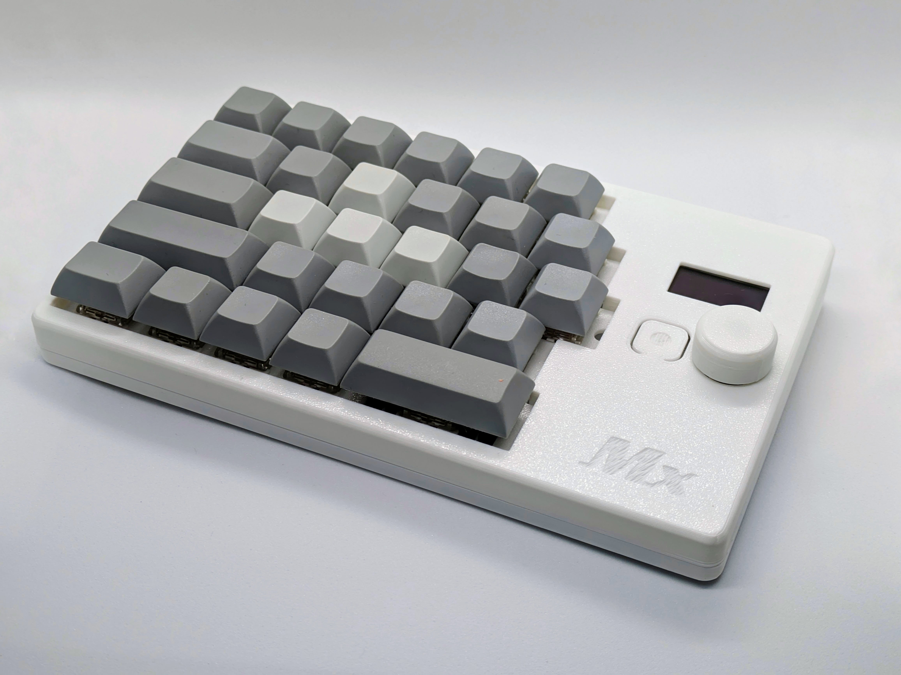
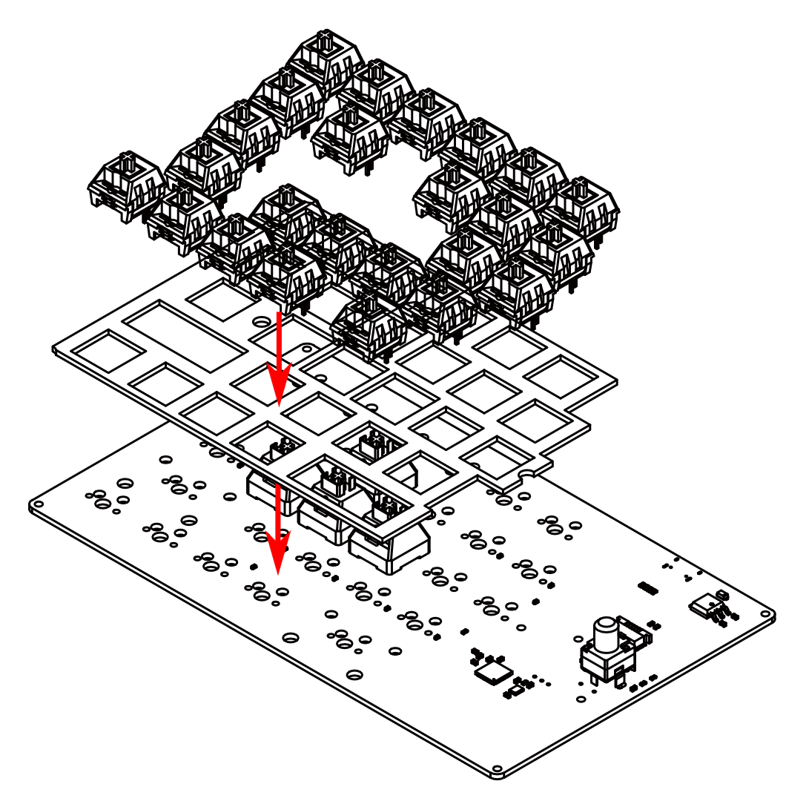
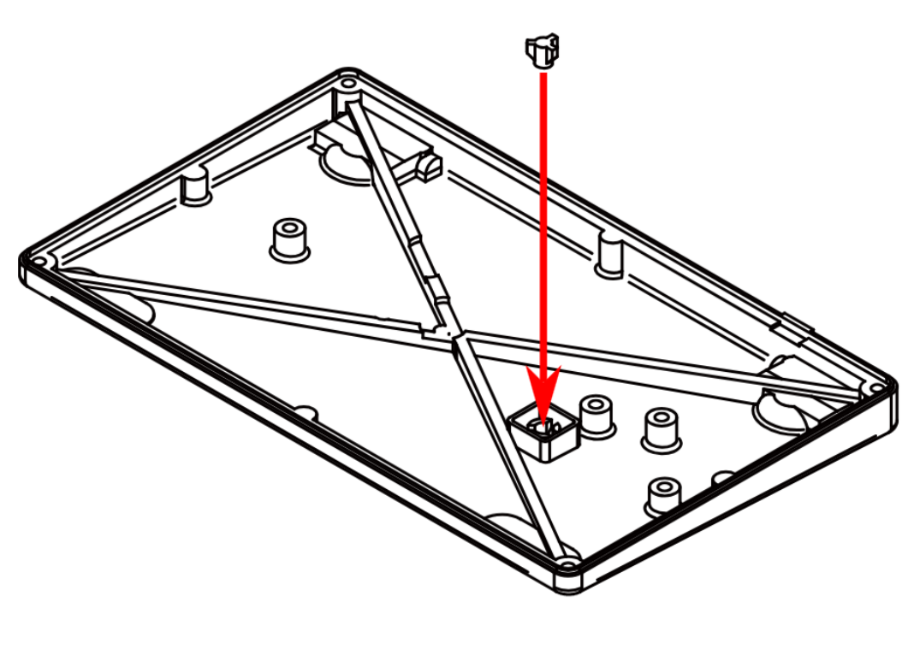
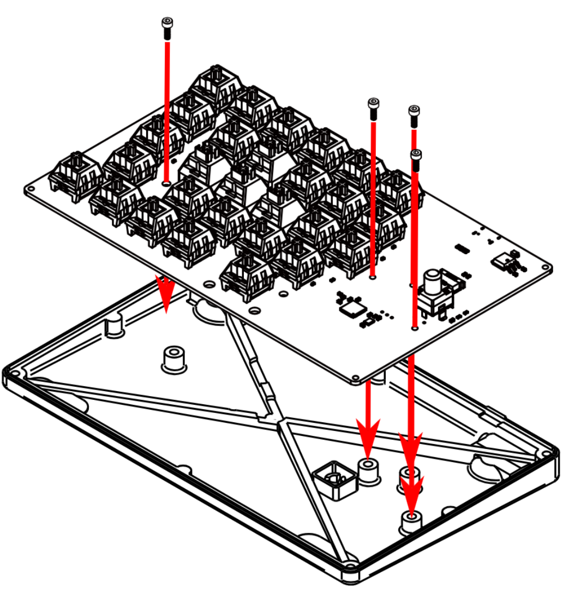
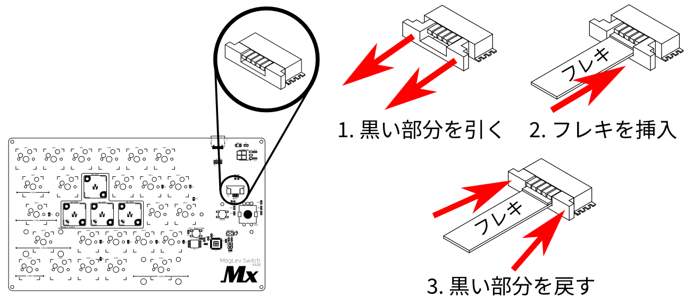
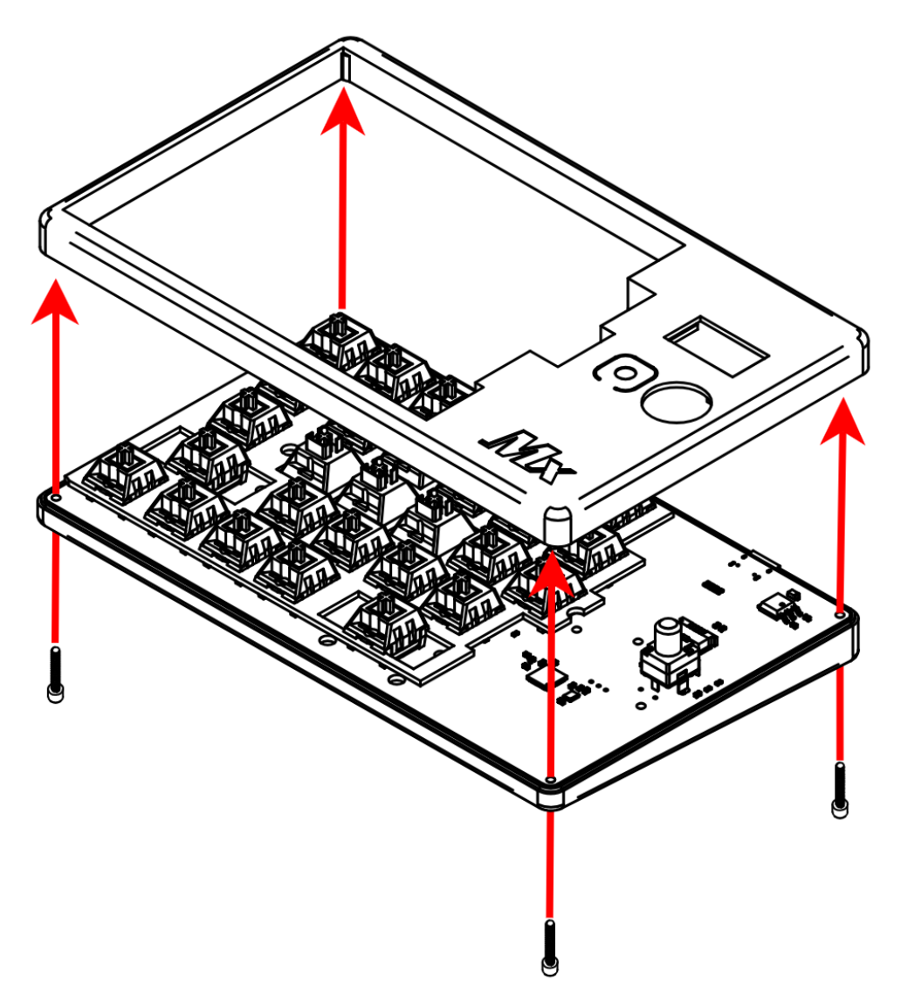
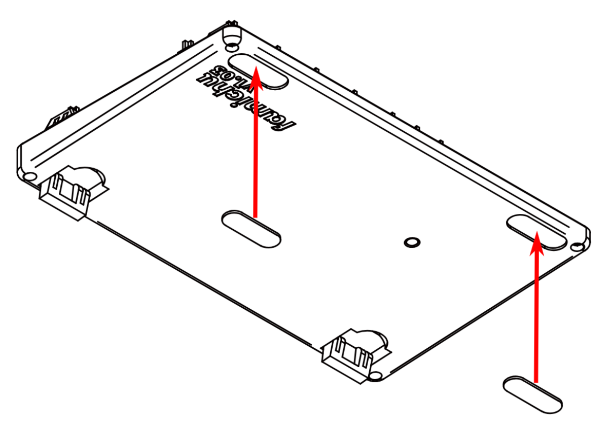
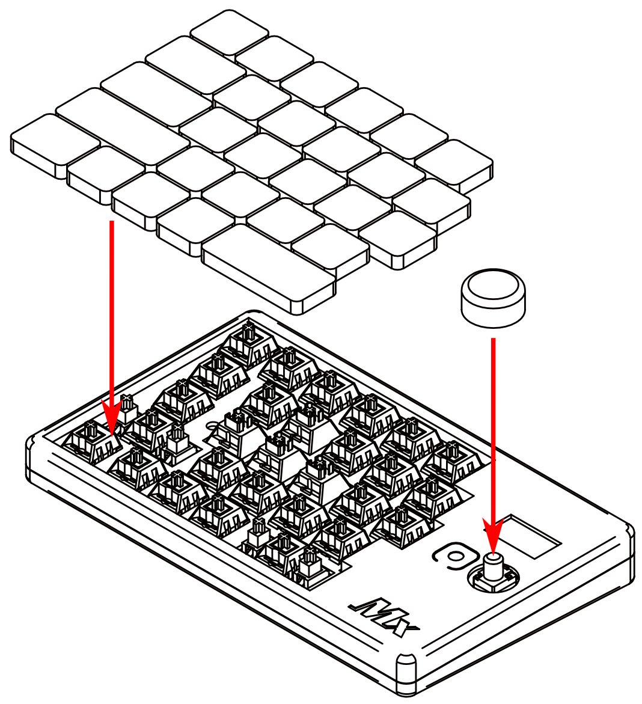
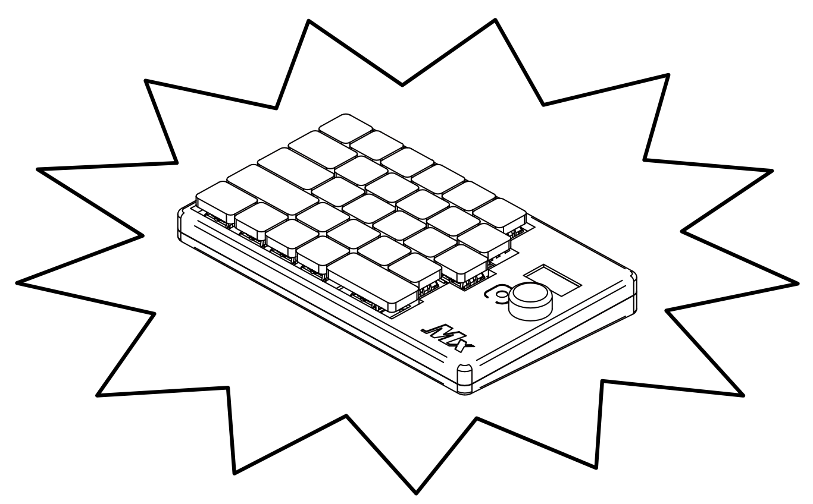

# MagLev Switch Reference Keyboard

## Summary
This keyboard is a reference keyboard for using the MagLev switch, which has linear-output Hall effect sensors and magnetic levitation switches.

## Features
- A 28-switches keyboard for the left hand
- Uses 4 MagLev switches for the WASD keys
- Able to read the depth of the MagLev switches
- Built-in OLED displaying MagLev switch depth graphs

## BOM
### Main PCB
- Main PCB x1
- Kailh Switch Socket x24
- Cherry MX compatible switch x24
- MagLev Switch MX x4
- Stabilizer(2U) x2
- Incremental rotary encoder(PEC12R series of compatible) x1
- RP2040 x1
- Other small devices(refer to the schematic)

### Flex-PCB with OLED
- Flex-PCB x1
- OLED SSD1366 x1
- Other small devices(please refer the schematic)

###  Shell
- Top case(3D printed) x1
- Top plate(3D printed) x1
- knob(3D printed) x1
- Bottom case(3D printed) x1
- Stand(3D printed) x2
- Rubber foot(25mmx8mm oval) x2
- Bottom switch cap(3D printed) x1
- Screw M2x5mm x4
- Screw M2x8mm x4
- Insert nut M2x3mm(OD3.5mm) x8
- Cherry MX compatible keycap x28

## 3D Printing
Use FFF 3D printers to print shell parts. 

## PCB
I had manufactured at JLCPCB. The main PCB in this repository has an LCSC number as well.
This allows you to order the PCBA without selecting individual devices.

## Assembly
- 1. Solder all devices.
    
- 2. Insert switches through a top plate.

- 3. Place the bottom switch cap onto the bottom case (Insert nuts into holes on the bottom plate if you print it by yourself.).

- 4. Fix the PCB with screws.

- 5. Insert an OLED module with a flex PCB into the top case (Insert nuts into holes on the top plate if you print it by yourself).

- 6. Connect the flex-PCB with the main PCB.

- 7. Close the top and bottom cases with screws.

- 8. Stick rubber feets.

- 9. Install keycaps and a knob.

- 10. Finish!

# Directory configuration
- bin: Binary of the firmware
- pcb: Schematics & PCB artworks
    - libs: PCB libraries
    - Reference_Keyboard: Main PCB
    - SSD1366_FFC_Adapter: Flex-PCB with OLED
- shell: 3D models for FFF printer
- src: Source codes of the firmware
